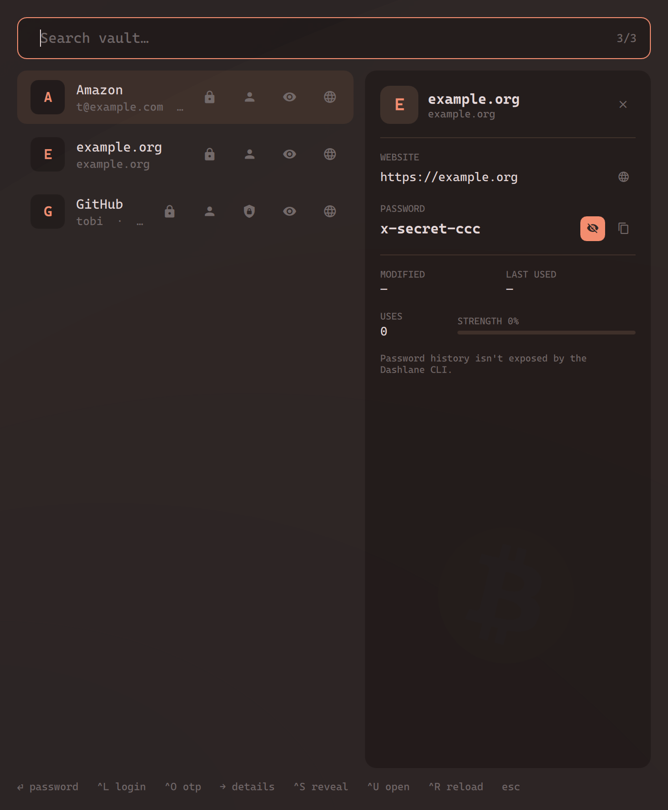

# dashlane-omarchy

A native Dashlane vault browser for Linux ([Omarchy](https://omarchy.org) / Hyprland), plus an Omarchy menu plugin.
Dashlane dropped its desktop apps in 2022; on Linux you get the browser extension and nothing else. This fills the gap for
everything *outside* the browser — SSH, terminals, desktop apps — as a thin, auditable layer over the official
[`dcli`](https://github.com/Dashlane/dashlane-cli). No reverse engineering, no custom crypto.



## Features
- Fuzzy search over your vault; ⏎ copies the password, `^L` login, `^O` one-time code
- Details sidebar like the extension: website, login/email, masked password with reveal, live OTP with countdown, note, category, modified/last used, strength
- Omarchy menu: `omarchy menu summon passwords` → entry → copy password / login / OTP
- Themed from your current Omarchy theme; keyboard-first
- Vault locks together with the screen (`dashlane-lock` wired into hypridle)
- Bar widget (centre section): click for a mini popup — search, ⏎ copies the password, `^L` login, `^O` OTP — like the Spotify mini player; "Open app" / middle-click / `^⏎` opens the full window. `omarchy-shell shell toggle dashlane-omarchy.vault` for a keybind.

## Security model
- **Auth and crypto are `dcli`'s.** The app never sees your master password: login/unlock happens in dcli's own terminal prompt. `install.sh` pins `dcli` to a release and verifies its sha256.
- **Secrets never enter the UI process wholesale.** `dashlane-list` strips `password`/`otpSecret` with `jq`; one field is fetched on demand via `dashlane-field`, travels through pipes only (never argv, never disk), and is wiped on entry change, sidebar close, quit, or after 10 s.
- **Clipboard:** `wl-copy --sensitive` (Omarchy's clipboard history skips it), cleared after 30 s.
- **Lock:** `dashlane-lock` runs `dcli lock`, closes the app, then locks the screen. Installed as hypridle `lock_cmd` / `before_sleep_cmd`, so the vault re-asks for the master password after every lock or sleep.
- **Out of scope:** in-browser autofill and domain matching (keep the extension for that); memory hardening inside `dcli` (it's Node); password history (not exported by `dcli`).

Everything that touches the vault is ~60 lines of bash in `bin/`; `test/test.sh` proves the strip / argv / clipboard claims with a fake `dcli`.

## Install
Requires Omarchy (Quickshell, `jq`, `wl-clipboard`, `gh`). Works on any Hyprland/Wayland box with Quickshell if you skip the Omarchy bits.
```sh
git clone https://github.com/<you>/dashlane-omarchy && cd dashlane-omarchy
./install.sh          # symlinks bin/ + .desktop, installs pinned dcli, wires hypridle lock (backup kept)
dcli sync             # first login (email, master password, device code)
dashlane-menu-sync    # generate the Omarchy menu
dashlane-app          # or the "Dashlane" launcher entry, or: omarchy menu summon passwords
```
Optional keybinds for `~/.config/hypr/bindings.lua`:
```lua
o.bind("SUPER + SHIFT + P", "Passwords", "dashlane-app")
o.bind("SUPER + ALT + P",   "Passwords menu", "omarchy-menu summon passwords")
```
`./uninstall.sh` reverts everything except `dcli` and its vault.

## Usage
| Key | Action |
|---|---|
| `⏎` | copy password |
| `^L` / `^O` | copy login (falls back to email) / one-time code |
| `→` `Tab` / `←` `Esc` | open / close details |
| `^S` | reveal password (10 s) |
| `^U` | open website |
| `^R` | reload vault |
| `Esc` | close details, then quit |

Re-run `dashlane-menu-sync` (or "Passwords → Sync vault" in the menu) after adding entries — Omarchy menu providers are hardcoded, so the submenu is generated statically.

## Layout
```
app/dashlane.qml       window, search, keys
app/Vault.qml          singleton: all dcli-facing logic + secret lifetime
app/Theme.qml          singleton: Omarchy theme colors
app/{Sidebar,EntryRow,Field,IconButton,LockedView}.qml
bin/dashlane-list      vault metadata JSON, secrets stripped
bin/dashlane-field     one field on demand
bin/dashlane-copy      copy → clipboard (sensitive, 30 s clear)
bin/dashlane-lock      dcli lock + screen lock (hypridle)
bin/dashlane-menu-sync Omarchy menu generator
bin/dashlane-sync      login terminal
plugin/                Omarchy bar-widget plugin: BarWidget.qml (icon) + Panel.qml (mini popup)
test/                  self-tests + fake dcli
```

## Development
```sh
test/test.sh
DASHLANE_JSON=$PWD/test/vault.json PATH=$PWD/test/fake:$PATH dashlane-app   # fixture vault, no login
```

MIT — see [LICENSE](LICENSE). Not affiliated with Dashlane.
